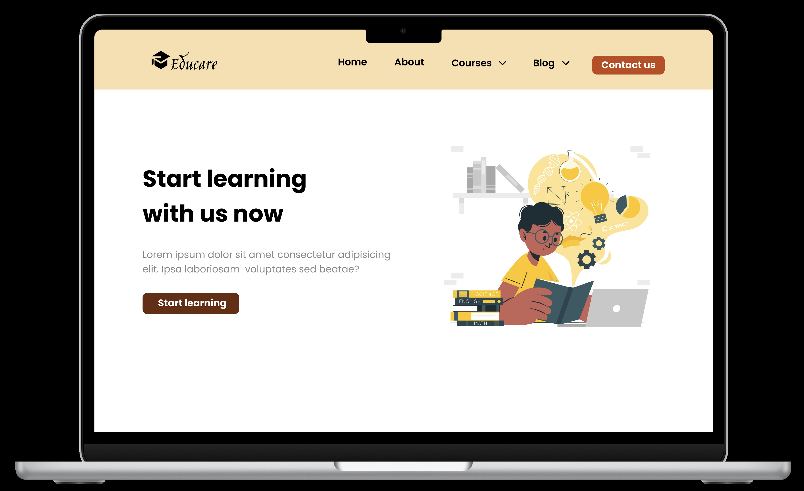

# Challenge - Education landing page

This project is inspired by the Figma mockup of [InnovateWithMe](https://www.figma.com/@innovatewithme) :
[https://www.figma.com/community/file/1298136848948382547/education-website-landing-page-full-website-design]()

The website is deployed on Netlify, at this URL : [https://main--spiffy-croissant-69c8fb.netlify.app/](https://main--spiffy-croissant-69c8fb.netlify.app/)

The responsive and animations parts was added in accordance with the graphic charter.

All images was provided by the Figma file.

